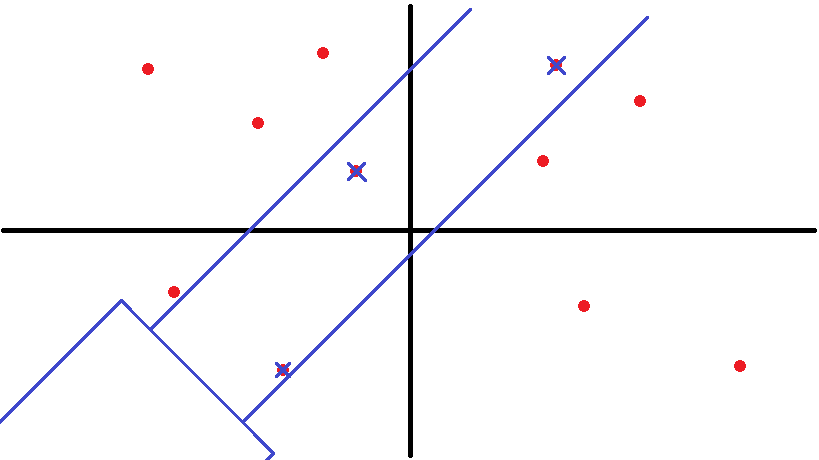

LaserCannon

1s

### Description

"To live or to die."

Space ship is going to launch, however scientists receive a bad news that there are many space trashes on the orbit.

For the space ship's safety, we have to destory these space trashes first.

The target field can be seen as a **two dimensional surface**. Many trashes are located in the field and every trash has two properties: **value** and **mul**. The two properties are set for evaluating HE's behavior.


HE is given a laser cannon in order to destroy these trashes. The laser cannon is so powerful that onece an attacking angle is decided, it is able to attack a linear field with infinite length. The linear field can be seen as two parallel lines with a tilt angle a, the distance between the two parallel lines can be any value. HE can choose anywhere to launch.



Every time HE use laser cannon to launch an attack, the trashes inside the linear field or even just on the boundary will be destoried. After that, HE will get a score depending on those destoried trashes. The score HE will get is the sum of all those trashes' "value" times the average "mul" of all those trashes.

Just like this:

$$
Score=\sum_{i=1}^{k}value[i]*\sum_{i=1}^{k}mul[i]/k
$$

Now, HE's task is to destory all the trashes in this field. The final score is the sum of each attack's score, and of course, HE wants to get a maximum score in the end.

### Input

The first line is an integer T, indicate there will be T test cases.

For each test cases:

The first line is an integer n ($n\le2000$), indicate there are n trashes in the field.

Each of the next n lines contains 4 integer: x, y, value, mul,  which discribes the position of the trash[i], its "value" and its "mul". ($-10000\le x,y\le10000, 1\le value,mul\le100$)

The next line is an integer a, means the tilt angle. ($0\le a\le 180$)

### Output

For each test cases:

First output the case number like "Case #x:", x is the sequence number of that test case.

Then output a real number, the maximum score HE is abled to get from this field. The answer should be accurate to 3 decimal places.

### Sample Input

```
1
3
1 3 3 1
2 1 2 2
3 4 2 1
45
```

### Sample Output

```
Case #1:
9.333
```

### Note

$\pi=3.1415926$