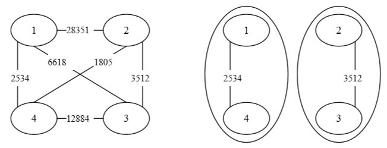

Energy

1s

### Description

"I want to be there."

在超级人工智能 HE 的帮助下，人类已经成功探索了一部分的宇宙空间，准备发射载人飞船前往火星。

飞船使用了一种特殊的反物质燃料来作为动力，在飞船的制造期间，同时人类也在从宇宙的各个地方收集这种反物质燃料。收集到的燃料被压缩成一些能量块存储在仓库中。

由于对反物质的特性并没有完全研究透彻，人类发现这些能量块两两之间都可能存在一种诡异的能量排斥现象，如果不能妥善解决存储问题，将影响到未来的许多工作。

科学家建造了2个特殊的仓库用于存放，当两块存在冲突的能量块被分别存放在两个仓库中时，它们的排斥作用就可以忽略不计了，只需要考虑存放在同一个仓库中的能量块的排斥情况。为了存储这些能量块，仓库需要用特殊材料制造，仓库需要承受的排斥能量越高，则建造仓库所需要的材料也越多。

为了减少建造材料的使用，不得不重新考虑收集得到的这n块能量块的存储分配问题。

现在，给出所有这n块能量块之间的冲突情况，要求找到一种分配方案，使得两个仓库中最高的冲突值最小。只要输出那个冲突值即可。

### Input

第一行是一个整数T，表示将有T组数据。

对于每一组数据：

第一行是2个整数n、m，分别表示能量块的数量，以及它们之间有冲突的对数；($n\le20000,m\le100000$)
第2~m+1行，每行3个整数a、b、c，表示能量块a与能量块b之间存在冲突，且它们能量排斥所产生的冲突值为c。($a,b\le n,0\le c\le1000000000$)

### Output

对于每一组数据：

首先输出“Case #x:”，x表示当前测试数据的序号。

然后是一个整数，表示两个仓库中的最大冲突值。

### Sample Input

```
1
4 6
1 4 2534
2 3 3512
1 2 28351
1 3 6618
2 4 1805
3 4 12884
```

### Sample Output

```
Case #1:
3512
```

### Note

对于以上样例说明如下：



采用这种方式分配存储，两个仓库中的最大冲突值为3512，其他任何方法都不会有更好的结果。